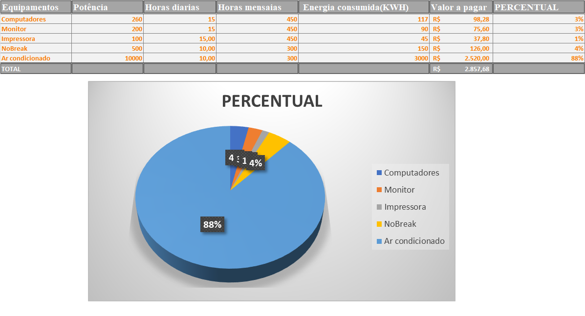

# Modelo-Office HELLO WORD

Este repositorio serve para aplicarmos os conheciementos atribuidos as aulas de projeto integrador 2, realizando atividades no Word, excel e  Power Point onde será por meio do git-hub que iramos demonstrar.

1.[Documento Excel](https://github.com/wesleykainan/Modelo-Office/blob/main/Projeto%20integrador%202.xlsx)

2.[Gráfico](https://github.com/wesleykainan/Modelo-Office/blob/main/ProjetoIntegrador2.png)

3.[Power Point](https://github.com/wesleykainan/Modelo-Office/blob/main/ProjetoIntegrador2.pptx)

4.[Documento Word](https://github.com/wesleykainan/Modelo-Office/blob/main/ProjetoIntegrador2.docx)

